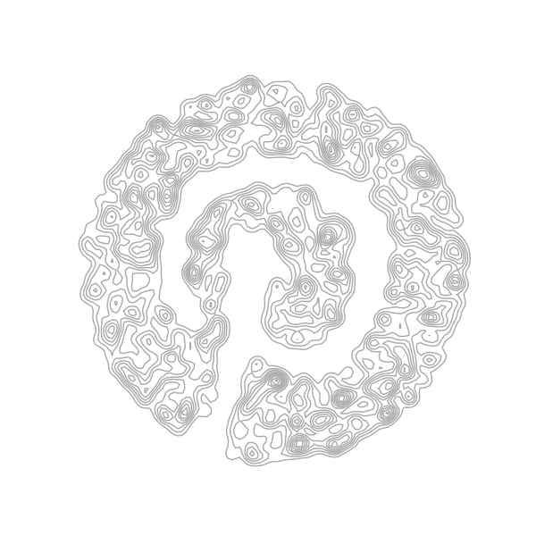

# kde-art

A simple script to make art based using kernel density estimation. It requires producing a stippled image, as below:

1. Change the image to grayscale
2. Make the image "washed out", i.e. make it whiter
3. Dither the image to black and white using Floyd-Steinberg dithering
4. Save the image in a PBM (Portable Bit Map) file, in the main tsp-art folder.

(More [here](https://wiki.evilmadscientist.com/Generating_TSP_art_from_a_stippled_image).)

## Producing the KDE images

Run it using the *plot_kde* function. Works best with white backgrounds and high-contrast (but whitened) images.

## Some example results:

- - - -

**
KDE art with a portrait**

**
KDE art with the Pinterest logo
**

- - - -

