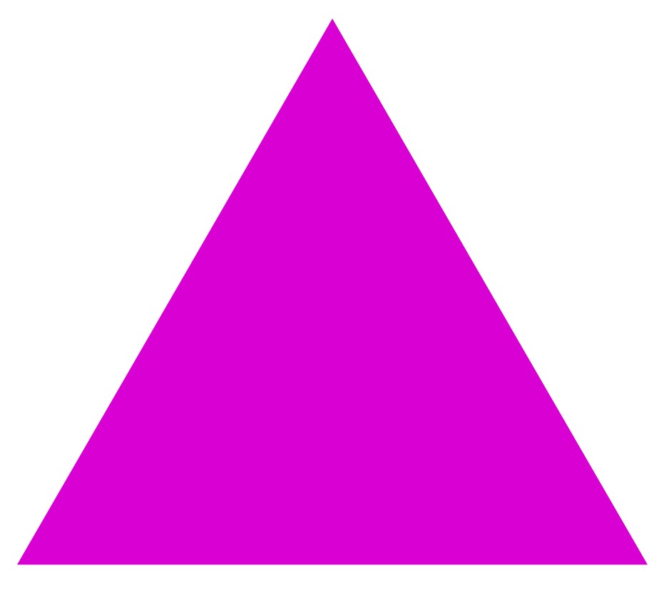
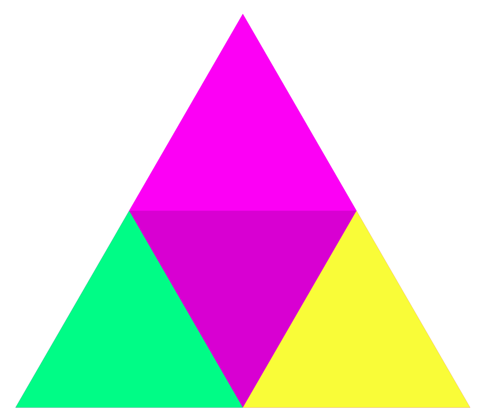
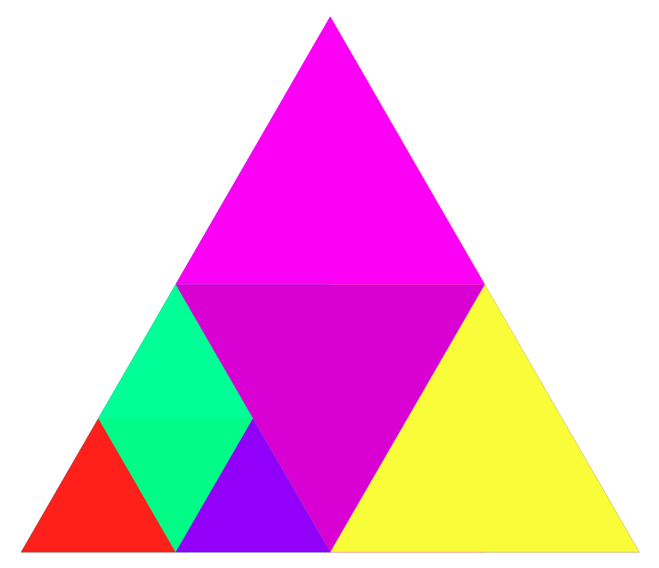
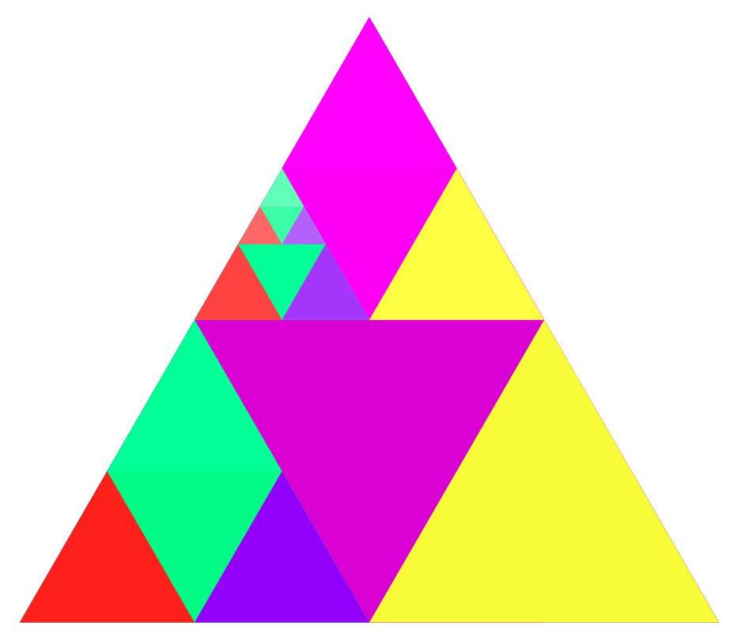
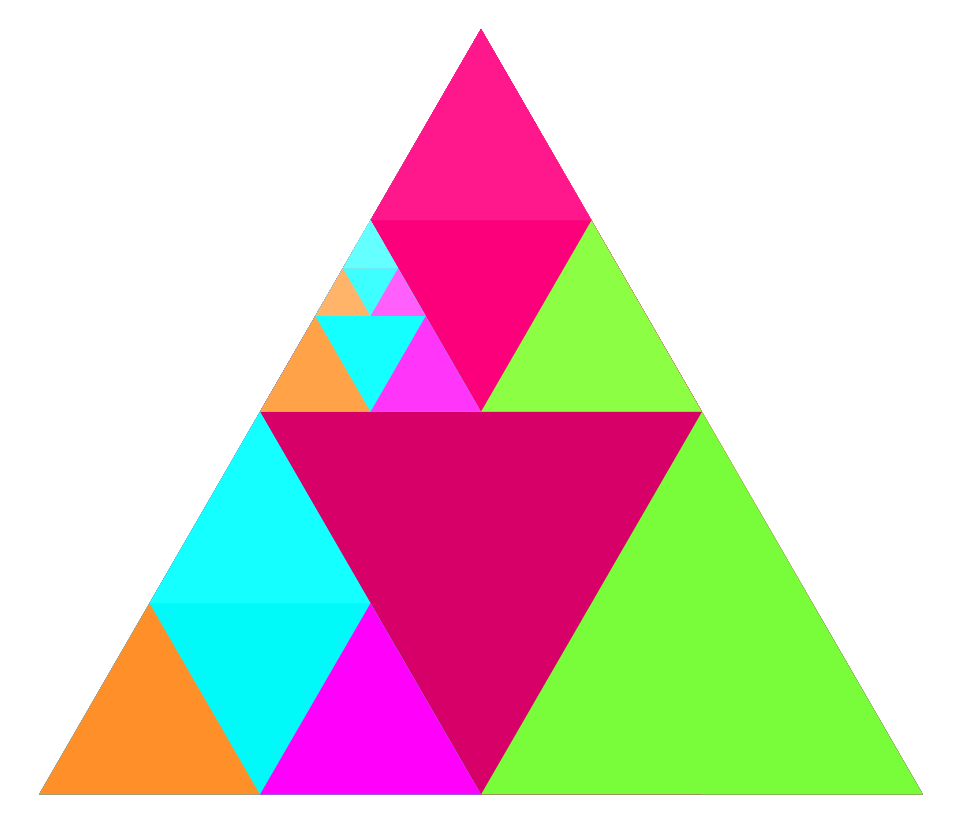
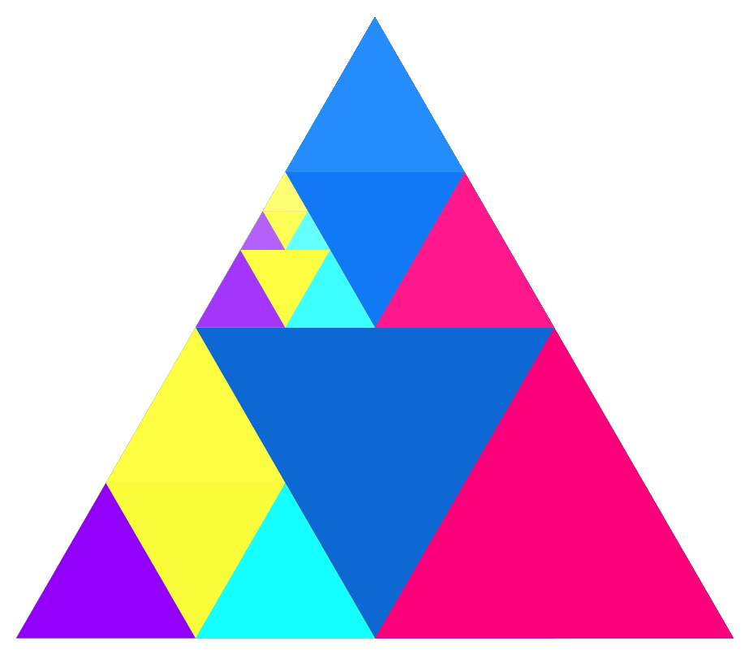

# sierpinski-chords

The [Sierpiński triangle](https://en.wikipedia.org/wiki/Sierpi%C5%84ski_triangle) is a fractal. Here's how to make it:
1. Start with an equilateral triangle.
2. Subdivide it into four smaller equilateral triangles and remove the central triangle.
3. Repeat step 2 with each of the remaining smaller triangles, infinitely.

This script makes an interactive Sierpiński triangle, by pairing it with chords on a piano. Each colour represents a note, and every triangle represents a major triad (I-III-V, as in C-E-G), as shown below. You can open and close multiple triangles using the mouse. Every triangle, once opened into three, replaces a note by its major chord one octave above. So **C2** becomes **C3-E3-G3**. You can then play those notes using the space bar, and shift all notes on the scale using the keyboard.

The initial code was taken from (roadtolarissa.com)[https://roadtolarissa.com/zoomable-sierpinski-triangle-with-d3-js/], and audio samples were downloaded from (theremin.music.uiowa.edu)[theremin.music.uiowa.edu].

## Triangles and chords:

- - - -

**
Initial triangle, corresponding to the C2 note.**

**
First chord, found by opening the first note: C3-E3-G3**

**
Opening the triangle corresponding to C3, the resulting chord is E3-G3-D4-G4-B4**

**
Another chord with many notes, based on C**

**
The same chord as above, but transposed to C#**

**
The same chord as above, but transposed to A**

- - - -

