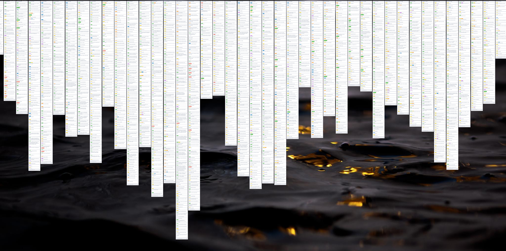

# trello-dataviz-2020

In February 2020, I decided to track my activities as a young academic using Trello. I was inspired by Terence Eden's use of it to track [what he did every week](
https://shkspr.mobi/blog/2020/01/another-year-over-and-what-have-you-done/), so I made this board. I might write a blogpost about this later.

It's a pretty simple data visualisation project:

1. Live through a year.
2. Track every task you do at your job.
3. As you track your tasks, label them in categories that make sense to you.
4. At the end of every week, create a "Done! YYYY-MM-DD" list on Trello, with those tasks. Feel free to have other lists with tasks yet to be done, if it helps.
5. Once you're done with your year, you should have something that looks like this

**
My 2020 at work, in a nutshell**

Once you're done, you just have to download your Trello data and play a bit to visualise it! I saved it into a `.svg` file, added some annotations and turned it an interactive D3.js visualisation, which you can see [here](https://evoluchico.github.io/artsy/trello-dataviz-2020/).
