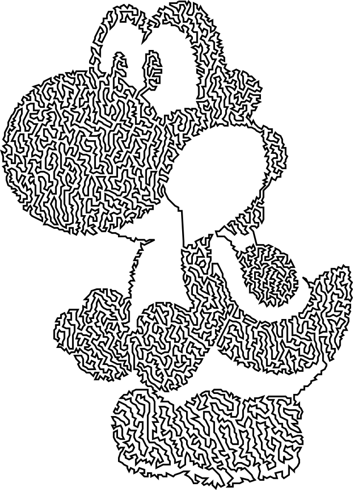
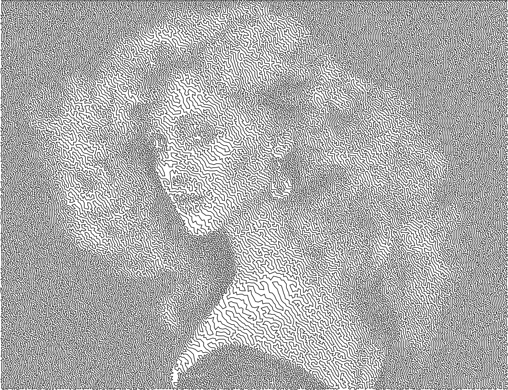
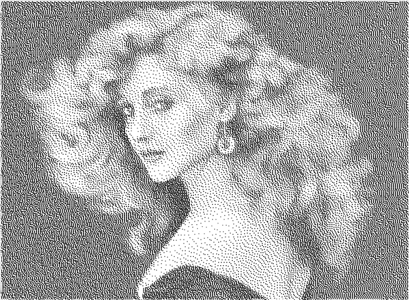

# tsp-art

A few scripts to make art based on the [travelling salesman problem](https://wiki.evilmadscientist.com/TSP_art). Most of the code is taken from the sources below:

* https://wiki.evilmadscientist.com/Generating_TSP_art_from_a_stippled_image
* https://wiki.evilmadscientist.com/Producing_a_stippled_image_with_Gimp
* https://github.com/evil-mad/EggBot/tree/master/other/TSP-stipple/tsp_art_tools
* http://www.math.uwaterloo.ca/tsp/concorde/downloads/downloads.htm

1. Change the image to grayscale
2. Make the image "washed out", i.e. make it whiter
3. Dither the image to black and white using Floyd-Steinberg dithering
4. Save the image in a PBM (Portable Bit Map) file, in the main tsp-art folder.

## Solving the TSP

I solve the TSP using Concorde, more specifically the [Lin-Kernighan heuristic](https://en.wikipedia.org/wiki/Lin%E2%80%93Kernighan_heuristic), which provides a pretty good solution in polynomial time. I downloaded the executables for _concorde_ and _linkern_ [here](http://www.math.uwaterloo.ca/tsp/concorde/downloads/downloads.htm), and here's an estimate of how long linkern takes to solve a TSP with a given number of points (on my desktop computer, of course):

| Points | 1,000 | 10,000 | 100,000 | 1,000,000 |
|--------|-------|--------|---------|-----------|
| Time   | 2s    | 15s    | 4 min   | 2h30      |

Run it with _python2 tspart.py filename.pbm_

## Some example results:

- - - -

**
TSP art with Yoshi the dinosaur**

**
TSP art with greyscale painting by Scott Bowlinger
**

- - - -

The .pbm file can also be used to make Voronoi-like figures, using the code in [voronoi-plots.py](voronoi-plots.py):

- - - -

**
Voronoi art with greyscale painting by Scott Bowlinger
**

- - - -
